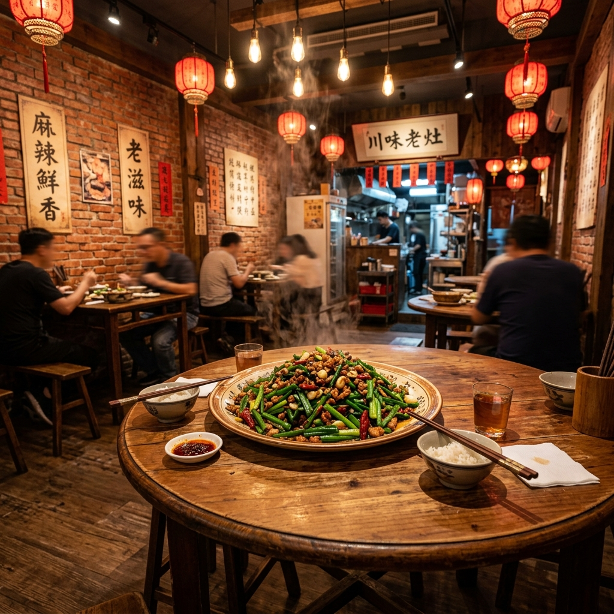

# 🎬 诸神之墙视频制作案：【美食花絮】台北花娘小馆 (Hua Niang)

本期视频策划将硬核的英伟达芯片供应链与温暖的人间烟火结合，讲述黄仁勋在台北 Computex 期间用一道家常菜“苍蝇头”款待全球科技巨头，并将该饭馆印上英伟达生态背板的故事。

---

## 📸 第一帧：Seedance 种子图

---

## 🎛 Seedance 2.0 多模态输入参数 (Production Config)

### 1. 图像转视频 (Image-to-Video) 基础配置
*   **输入图像 (Base Image)**：使用上方生成的 `hua_niang_seed_image_1780648866620.png` 图像作为首帧。
*   **动作幅度 (Motion Amplitude)**：`3` (中等运动强度，确保饭馆内热气、食客动作和烛光闪烁自然)。
*   **画面重构强度 (Denoising Strength)**：`0.45` (保留首帧结构，避免饭馆背景变形)。

### 2. 视觉提示词 (Visual Prompt)
> **Prompt**: *“Volumetric steam rising slowly from the plate of sautéed chives at the center, warm hanging lanterns swaying slightly in the breeze, diners in the background chatting and eating with dynamic movements, warm low-key film lighting, cinematic camera slowly panning left, photorealistic, 8k resolution.”*

### 3. 环境音效提示词 (Audio Sync Prompt)
> **Audio Prompt**: *“Cozy restaurant ambient sound, sizzling sound of hot oil and stir-fry from the kitchen in the background, low chatter of diners, clinking of beer glasses and ceramic bowls, warm and lively atmosphere.”*

---

## 📜 60 秒分镜脚本与口播对照表

| 时长 | 视觉画面 (Visual & Web UI Setup) | 解说口播 (Voiceover Script) | 音效 & BGM |
| :--- | :--- | :--- | :--- |
| **0-10s** | 1. 网页端高亮“花娘小馆”Logo，屏幕四周变暗。 2. 镜头快速拉近，无缝渐变切换到 **Seedance 渲染出来的温暖饭馆特写画面**，盘中的“苍蝇头”正冒着热气。 | **万亿算力帝国的生态大屏幕上，竟然藏着一家台北川菜馆？** 没错，在马斯克 xAI 的右边，这个写着“Hua Niang”的 Logo，正是台北著名的“花娘小馆”。 | **【BGM】**：开场高燃电子乐突然戛然而止，转为温暖舒适的台式民谣吉他。 **【音效】**：炒菜的刺啦声、酒杯碰撞声。 |
| **10-25s** | 镜头滑移，展示黄仁勋在花娘小馆门口被媒体和粉丝“野生捕获”的合成照，或是饭馆内高朋满座的欢快场景。 | 它是英伟达创始人黄仁勋的私人“大食堂”。在台北电脑展期间，**老黄在这里自掏腰包，包场款待了台积电、广达、鸿海等全球 AI 供应链的顶级 CEO**。身价万亿的巨头们，就是在这张圆桌上，吃着几十块钱的家常菜，聊出了全球算力版图的未来。 | **【BGM】**：吉他曲风渐强，加入轻快的鼓点。 **【音效】**：相机快门声，人群笑声。 |
| **25-45s** | 镜头对准那一盘“苍蝇头”进行超近距离特写。韭菜花、碎肉末和豆豉在慢镜头下翻滚，油光发亮。 | 这里的招牌菜叫做“苍蝇头”。其实它跟苍蝇毫无关系，是由韭菜花、碎肉和豆豉爆炒而成。**这道菜的逻辑，像极了英伟达的 AI 生态**——看似都是最平凡的底层元件，一旦被老黄这位顶级大厨串联并精准调优，就爆发出了无可替代的极致体验！ | **【音效】**：猛火爆炒声加强，餐具轻微碰撞。 |
| **45-55s** | 镜头慢慢拉远，画面从饭馆特写无缝退回至“诸神之墙”网页系统的全景。 | 这就是英伟达的品牌魅力：**冷冰冰的芯片和硅片之外，永远保留着一份接地气的在地人文情怀。** 连吃货都能改变世界，你还有什么理由不努力？ | **【BGM】**：轻快温暖的吉他渐弱。 |
| **55-60s** | 屏幕上方打出“诸神之墙交互 Wiki”的 GitHub 地址和二维码。 | **在老黄最爱的食堂旁边，还藏着好几家神秘的美食彩蛋。** 关注我，下一期带你拆解老黄深夜打卡的王记府城肉粽！ | **【音效】**：清脆的叮咚提示音。 |

---

## 💡 制作小贴士
1. **配音推荐**：使用 **十一号声音 (ElevenLabs)** 或 **剪映“男声解说-阿林”**，声线选择略带沙哑、讲故事感强、温暖的中音。
2. **转场技巧**：利用您的交互系统做片头和片尾，让观众看到“从地图开孔高亮 -> 跃迁进真实画面 -> 退回地图”的连贯视觉，建立独特的短视频 IP 符号。
